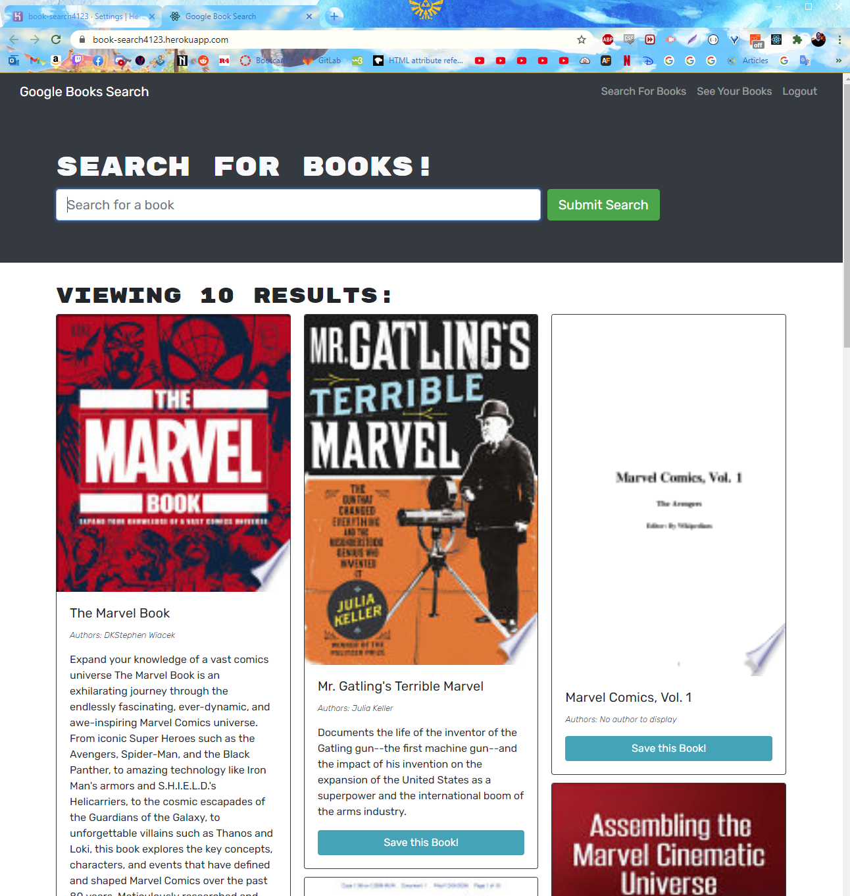

# Book-Search-Engine

## Description

A full stack MERN application. This app is built with an MongoDB Database and express and apollo servers. This app uses GraphQL to query and mutate data from the database. The front end is built with react and react-router to show the data in a user friendly way that does not require re-rendering the page.

## Table of Contents

* [Installation](#installation)
* [Usage](#usage)
* [Credits](#contributing)
* [License](#license)
* [Reference](#reference)

## Installation

* copy source code
* run npm install
* run npm start

## Usage 

* The App can be found [Here](https://book-search4123.herokuapp.com/)
* Create an account by providing a username, email, and password
* Search for books and save them to your account by selecting 'Save this Book'
* See a list of saved books under See Your Books
* Remove any books fro that list by selecting 'Delete this Book'

## Reference

[Link to Deployed Site](https://book-search4123.herokuapp.com/)

